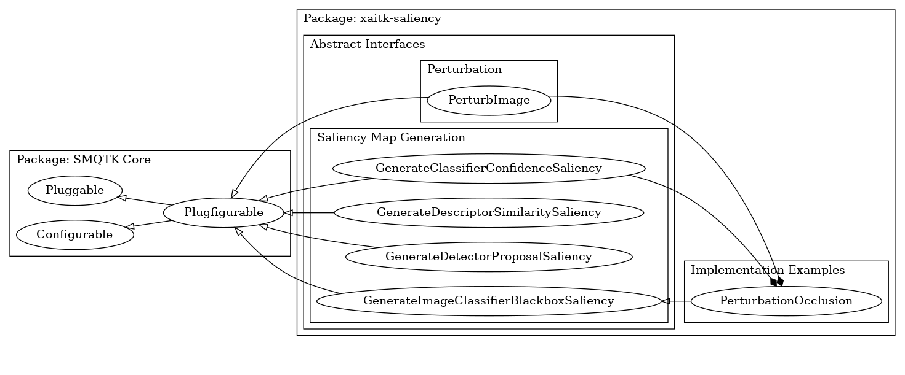

==============================================
Interfaces
==============================================

The xaitk-saliency API consists of a number of object-oriented functor interfaces for saliency heatmap generation.
These initial interfaces focus on black-box visual saliency.
We define the two high-level requirements for this initial task: reference image perturbation in preparation for
black-box testing, and saliency heatmap generation utilizing black-box inputs.
We define a few similar interfaces for performing the saliency heatmap generation, separated by the intermediate
algorithmic use cases: image similarity, classification, and object detection.
We explicitly do not require an abstraction for the black-box operations to fit inside.
This is intended to allow for applications using these interfaces while leveraging existing functionality, which only
need to perform data formatting to fit the input defined here.
Note, however, that some interfaces are defined for certain black-box concepts as part of the SMQTK ecosystem (e.g.
in `SMQTK-Core <https://github.com/Kitware/SMQTK-Core>`_, `SMQTK-Descriptors <https://github
.com/Kitware/SMQTK-Descriptors>`_, `SMQTK-Classifier <https://github
.com/Kitware/SMQTK-Classifier>`_, `SMQTK-Relevancy <https://github.com/Kitware/SMQTK-Relevancy>`_, and other SMQTK-*
modules).

These interfaces are based on the plugin and configuration features provided by SMQTK-Core to allow convenient hooks
into implementation, discoverability, and factory generation from runtime configuration.
This allows for both opaque discovery of interface implementations from a class-method on the interface class object,
as well as instantiation of a concrete instance via a JSON-like configuration fed in from an outside resource.

   Figure 1: Abstract Interface Inheritance.

..When adding new classes within interfaces, sort them alphabetically.

---------------------------
Image Perturbation
---------------------------

The PerturbImage interface abstracts the behavior of taking a reference image and generating some number perturbations
of the image along with paired mask matrices that indicate where perturbations have occurred and to what amount.

Implementations should impart no side effects on the input image.

Immediate candidates for implementation of this interface are occlusion-based saliency algorithms [3] that perform
perturbations on image pixels.

Interface: PerturbImage
------------------------
.. autoclass:: xaitk_saliency.interfaces.perturb_image.PerturbImage
   :members:

Image Occlusion via Perturbation Masks
-----------------------------------------

A common intermediate step in this process is applying the generated perturbation masks to imagery to produce occluded
images.
We provide two utility functions as baseline implementation to perform this step:

* ``xaitk_saliency.utils.masking.occlude_image_batch`` - performs the transformation as a batch operation

* ``xaitk_saliency.utils.masking.occlude_image_streaming`` - performs the transformation in a streaming method with
  optional parallelization in that streaming

While the batch version is simpler and in many cases the faster of the two versions, the streaming version may be more
applicable to large image masks or when a great deal of masks are being input, where in such cases the batch version
would exceed available memory.

.. autofunction:: xaitk_saliency.utils.masking.occlude_image_batch

.. autofunction:: xaitk_saliency.utils.masking.occlude_image_streaming

----------------------------
Heatmap Generation
----------------------------

These interfaces comprise a family of siblings that all perform a similar transformation, but require different
standard inputs.
There is no standard to rule them all without being so abstract that it would break the concept of interface
abstraction, or the ability to substitute any arbitrary implementations of the interface without interrupting successful
execution.
Each interface is intended to handle different black-box outputs from different algorithmic categories.
In the future, as additional algorithmic categories are identified for which saliency map generation is applicable,
additional interfaces may be defined and added to this initial repertoire.

Interface: GenerateClassifierConfidenceSaliency
------------------------------------------------

This interface proposes that implementations transform black-box image classification scores into saliency heatmaps.
This should require a sequence of per-class confidences predicted on the reference image, a number of per-class
confidences as predicted on perturbed images, as well as the masks of the reference image perturbations (as would be
output from a ``PerturbImage`` implementation).

Implementations should use this input to generate a visual saliency heatmap for each input “class” in the input. This
is both an effort to vectorize the operation for optimal performance, as well as to allow some algorithms to take
advantage of differences in classification behavior for other classes to influence heatmap generation.
For classifiers that generate many class label predictions, it is intended that only a subset of relevant class
predictions need be provided here if computational performance is a consideration.

An immediate candidate implementation for this interface is the RISE algorithm [2] and occlusion-based saliency
algorithms [3] that generate saliency heatmaps.

.. autoclass:: xaitk_saliency.interfaces.gen_classifier_conf_sal.GenerateClassifierConfidenceSaliency
   :members:

Interface: GenerateDescriptorSimilaritySaliency
-----------------------------------------------

This interface proposes that implementations require externally generated feature-vectors for two reference images
between which we are trying to discern the feature-space saliency.
This also requires the feature-vectors for perturbed images as well as the masks of the perturbations as would be
output from a ``PerturbImage`` implementation.
We expect perturbations to be relative to the second reference image feature-vector.

An immediate candidate implementation for this interface is the SBSM algorithm [1].

.. autoclass:: xaitk_saliency.interfaces.gen_descriptor_sim_sal.GenerateDescriptorSimilaritySaliency
   :members:

Interface: GenerateDetectorProposalSaliency
-------------------------------------------

This interface proposes that implementations transform black-box image object detection predictions into visual
saliency heatmaps.
This should require externally generated object detection predictions over some image, along with predictions for
perturbed images and the perturbation masks for those images as would be output from a ``PerturbImage`` implementation.
Object detection representations used here would need to encapsulate localization information (i.e. bounding box
regions), class scores, and objectness scores (if applicable to the detector, such as YOLOv3).
Object detections are converted into (4+1+nClasses) vectors (4 indices for bounding box locations, 1 index for
objectness, and nClasses indices for different object classes).

Implementations should use this input to generate a visual saliency heatmap for each input detection.
We assume that an input detection is coupled with a single truth class (or a single leaf node in a hierarchical
structure).
Input detections on the reference image may be drawn from ground truth or predictions as desired by the use case.
As for perturbed image detections, we expect those to usually be decoupled from the source of reference image
detections, which is why below we formulate the shape of perturbed image detects with ``nProps`` instead of ``nDets``
(though the value of that axis may be the same in some cases).

A candidate implementation for this interface is the D-RISE [4] algorithm.

.. autoclass:: xaitk_saliency.interfaces.gen_detector_prop_sal.GenerateDetectorProposalSaliency
   :members:

Detection formatting helper
^^^^^^^^^^^^^^^^^^^^^^^^^^^
The :py:meth:`.GenerateDetectorProposalSaliency.generate` method takes in a
specifically formatted matrix that combines three aspects of common
detector model outputs:
  * bounding boxes
  * objectness scores
  * classification scores

We provide a helper function to merge distinct output data into the unified
format.

.. autofunction:: xaitk_saliency.utils.detection.format_detection

---------------------------------------------
End-to-End Saliency Generation
---------------------------------------------

Unlike the previous saliency heatmap generation interfaces, this interface uses a black-box classifier as input along
with a reference image to generate visual saliency heatmaps.

A candidate implementation for this interface is the ``PerturbationOcclusion`` implementation or one of its
sub-implementations (``RISEStack`` or ``SlidingWindowStack``).

Interface: GenerateImageClassifierBlackboxSaliency
---------------------------------------------------

.. autoclass:: xaitk_saliency.interfaces.gen_image_classifier_blackbox_sal.GenerateImageClassifierBlackboxSaliency
   :members:

------------------
Code Examples
------------------

For Jupyter Notebook examples of xaitk-saliency interfaces, see the :file:`examples/` directory of the project.

------------------
References
------------------

1. Dong B, Collins R, Hoogs A. Explainability for Content-Based Image Retrieval. InCVPR Workshops 2019 Jun (pp. 95-98).
2. Petsiuk V, Das A, Saenko K. Rise: Randomized input sampling for explanation of black-box models. arXiv preprint arXiv:1806.07421. 2018 Jun 19.
3. Zeiler MD, Fergus R. Visualizing and understanding convolutional networks (2013). arXiv preprint arXiv:1311.2901. 2013.
4. Petsiuk V, Jain R, Manjunatha V, Morariu VI, Mehra A, Ordonez V, Saenko K. Black-box explanation of object detectors via saliency maps. arXiv preprint arXiv:2006.03204. 2020 Jun 5.
