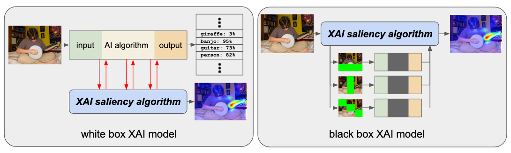

Introduction
============

The XAITK-Saliency package implements a class of XAI algorithms known
as `saliency algorithms`. The basic machine learning application pipeline is shown in Figure 1:

.. figure:: figures/intro-fig-01.png

   Figure 1: A basic AI pipeline.

In this scenario, an AI algorithm operates on an input (text, image,
etc.) to produce some sort of output (classification, detection, etc.) Saliency algorithms build on
this to produce visual explanations in the form of saliency maps as shown in Figure 2:

.. figure:: figures/intro-fig-02.png

   Figure 2: The AI pipeline augmented with a saliency algorithm.

At a high level, saliency maps are typically colored heatmaps applied
to the input, highlighting regions that are somehow significant to
the AI. Figure 3 shows sample saliency maps for text and images.

.. figure:: figures/intro-fig-03.png

   Figure 3: Sample saliency maps for text (left, from `Tuckey et al.
   <https://arxiv.org/abs/1907.05664>`_) and images (right, from `Dong et
   al. <https://openaccess.thecvf.com/content_CVPRW_2019/html/Explainable_AI/Dong_Explainability_for_Content-Based_Image_Retrieval_CVPRW_2019_paper.html>`_)

.. note:: The XAITK-Saliency toolkit currently focuses on providing saliency
          maps for images.

Image Saliency Maps: An Intuitive Introduction
----------------------------------------------

Figure 4 shows a deep learning pipeline for recognizing objects in
images; pixels in the image (in green) are processed by the pipeline
(in yellow) to produce the output (in orange). Here, the system has been
trained to recognize 1000 object categories. Its output is a list of
1000 numbers, one for each object type; each number is between 0 and
1, representing the system's estimate of whether or not that
particular object is in the image.

.. figure:: figures/cnn-tagged-scaled.png

   Figure 4: Typical object recognition CNN architecture; the image
   (green, left) is processed left to right through the CNN (yellow)
   to produce an output vector (orange, right). Diagram from
   `Krizhevsky et
   al. <https://proceedings.neurips.cc/paper/4824-imagenet-classification-with-deep-convolutional-neural-networks.pdf>`_

This operation is "all or nothing" at both ends: the entire image must
be processed, and the entire vector must be output. There is no
mechanism by which a subset of the output can be traced back to a
subset of the input. Yet it seems reasonable to ask questions such as:

* The input image is a camel; why did the system give a higher
  likelihood to "horse" than "camel"?

* The input image is a kitchen, but the system gave a high likelihood
  to "beach ball". What parts of the image were responsible for this?

* The input image contains two dogs, and the system gave a high
  likelihood for "dog". How would this change if one of the dogs
  wasn't in the image?

* The input image contains a dog and a cat, and the system gave a high
  likelihood for "cat" but not "dog". How will the system respond if
  the cat is removed?

At some level, these questions require a degree of *introspection*;
the system must produce not only the output, but also some information
about **how** the output was produced.

To avoid confusion, we need some definitions:

* The **AI algorithm, or AI,** is the algorithm whose output we are trying to
  explain. An AI operates according to its **AI model**; contemporary
  AIs are built around CNNs such as in Figure 4, examples of other models
  include decision trees and support vector machines.

* The **Explainable AI system, or XAI**, is the system we attach to
  the AI to generate explanations (as in Figure 2.) The XAI may itself
  use CNNs, but these details are typically hidden from the XAI user.

In order to answer questions such as the ones raised above, the XAI
must have some way of interacting with the AI. There are two popular
approaches to this:

1) The **white box** approach: the AI system is altered to open or
   expose its model. The XAI examines the state of the AI model as the
   AI generates its output, and uses this information to create the explanation.

2) The **black box** approach: the AI's model is not exposed; instead,
   the XAI probes the AI by creating an *additional set of input
   images* which perturb or change the original input in some way. By
   comparing the original output to that for the related images,
   we can deduce certain aspects of the how the AI and its model behaves.

These are illustrated in Figure 5. Note how the AI algorithm is
obscured in the black box model.

   Figure 5: White box vs. black box approaches to XAI. The white box
   approach has access to the AI model; the black box approach does
   not and instead repeatedly probes the AI with variations on the
   input image.

.. note:: The white box vs. black box distinction refers to *using the
          AI model after it has been created*; nothing is implied
          about how the model is constructed.

Let's take a look at the pros and cons of these two approaches.

White Box Methods
^^^^^^^^^^^^^^^^^

The **white box** approach to XAI (Figure 5, left) exposes some (or all) of the
internal state of the AI model; the explanation draws a connection
between this exposed state and the AI's output. Some AI methods are
intrinsically introspective to the point where they are not so much
"white box" as transparent:

* In `linear regression
  <https://en.wikipedia.org/wiki/Linear_regression>`_, the influence of
  the observations on the solution is an immediate consequence of the
  method.

* In a `decision tree <https://en.wikipedia.org/wiki/Decision_tree>`_,
  the output is directly computed by making the comparisons and
  branches encoded in the AI's model.

An example of a white box explanation method for CNNs is Grad-CAM (`paper <https://arxiv.org/abs/1610.02391>`_, `code <https://github.com/ramprs/grad-cam/>`_), which exposes some (but not all) of the CNN layers to the explanation generation algorithm.

.. figure:: figures/intro-grad-cam-annotated.png

   Figure 6: Grad-CAM architecture. Functional regions annotated to
   align with Figure 4: input in green, CNN architecture in yellow,
   output in orange. The explanation functionality is in blue; the
   APIs granting access to the model are circled in red. Figure from
   the `Grad-CAM code repo. <https://github.com/ramprs/grad-cam/>`_

In Grad-CAM, first the model computes its output per the typical
processing flow: input (green), through the CNN (yellow), to the
output (orange.) The explanation is created via an additional
processing step that uses the output and feature maps from within the
CNN (made available to the XAI through the red circles) to measure and
visualize the activation of those regions associated with the output
(orange).

Two aspects typical of white box methods are demonstrated here:

* **The explanation could not have been created from the output
  alone**. In order to operate, the explanation algorithm (blue)
  required access to both the output *and* the CNN internal state.

* **The XAI implementation is tightly coupled to the AI's CNN model
  architecture exposed by the API**. Although the *method* may be
  general, any particular *implementation* will expect the AI's CNN
  architecture to conform to the specifics of the API.

In general, pros and cons of white box approaches are:

Pros
""""

* A white box XAI can choose to **leverage its tight coupling to the
  AI model** to maximize the information available, at the sacrifice of
  generalization to other AI models.

* A white box XAI **accesses the actual AI model's computation which generated
  the output**. The explanation is derived directly from what the
  AI model computed about the input, in contrast to black box XAIs
  which can only indirectly compare the output to output from slightly
  different inputs.

* A white box XAI is usually more computationally efficient, since it
  typically only requires a single forward / backward pass through the
  AI model. In Figure 5, the white box approach on the left interacts
  with the AI during its single processing run to produce the output;
  in comparison, black box methods (such as in Figure 5 on the right)
  typically run the AI network multiple times.

Cons
""""

* The flip side of tighter XAI integration to a specific AI model or
  class of models is **loss of generality**. An explanation technique
  that works for one model can be difficult to port to other
  AI models. Lack of generality can also make it harder to evaluate
  explanation algorithms across AI models.

* It may be necessary to **modify the AI model implementation** to gain
  access to the internal state. Depending on the environment in which
  the AI was developed and delivered, this problem may be trivial
  or insurmountable.

* Similarly, the white box XAI may **require updating as the
  AI model evolves**. Tight coupling introduces a dependency which must
  be managed, possibly increasing development costs.

Black Box Methods
^^^^^^^^^^^^^^^^^
*Explanation options are correlated to how the related input are
generated. pros: independent of the model; operates across all models; does not
require access to the model implementation. cons: requires extra work
to generate and process the related images; makes only indirect /
differential observations about the original input / output pair;
generally more resource intensive than white box.*

XAITK-Saliency Map Algorithms
--------------------------------
*Discuss the provided XAITK-Saliency algorithms in terms of the above.*
