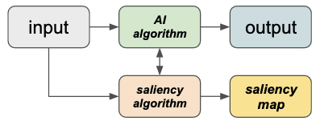
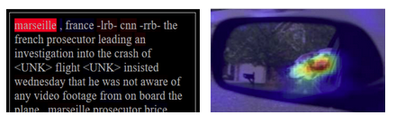
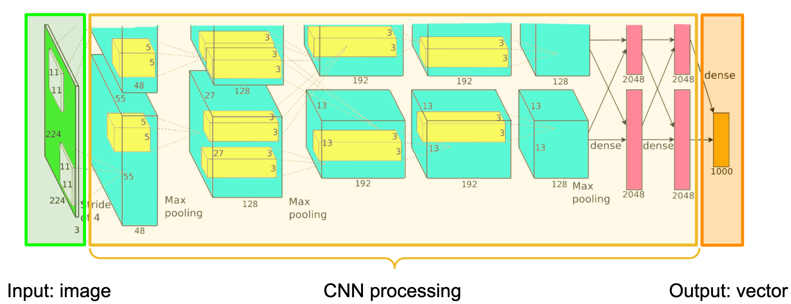
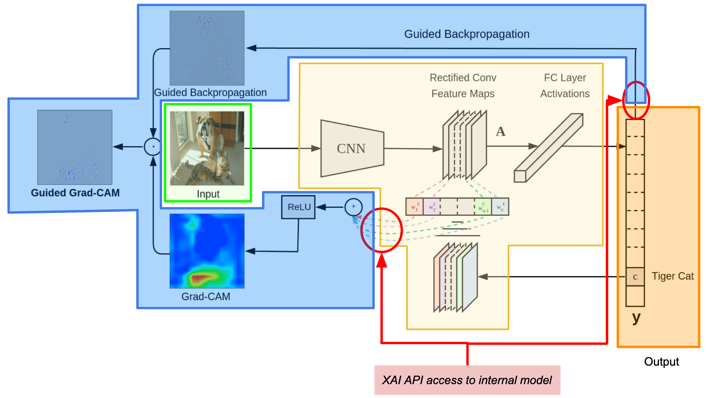

Introduction
============

The XAITK-Saliency package implements a class of XAI algorithms known
as `saliency algorithms`. The basic machine learning application pipeline is shown in Figure 1:

.. figure:: figures/intro-fig-01.png

   Figure 1: A basic AI pipeline.

In this scenario, an AI algorithm operates on an input (text, image,
etc.) to produce some sort of output (classification, detection, etc.) Saliency algorithms build on
this to produce visual explanations in the form of saliency maps as shown in Figure 2:

   Figure 2: The AI pipeline augmented with a saliency algorithm.

At a high level, saliency maps are typically colored heatmaps applied
to the input, highlighting regions that are somehow significant to
the AI. Figure 3 shows sample saliency maps for text and images.

   Figure 3: Sample saliency maps for text (left, from `Tuckey et al.
   <https://arxiv.org/abs/1907.05664>`_) and images (right, from `Dong et
   al. <https://openaccess.thecvf.com/content_CVPRW_2019/html/Explainable_AI/Dong_Explainability_for_Content-Based_Image_Retrieval_CVPRW_2019_paper.html>`_)

.. note:: The XAITK-Saliency toolkit currently focuses on providing saliency
          maps for images.

Image Saliency Maps: An Intuitive Introduction
----------------------------------------------

Figure 4 shows a deep learning pipeline for recognizing objects in
images; pixels in the image (in green) are processed by the pipeline (in yellow)
to produce the output (in orange). Here, the system has been trained
to recognize 1000 object categories. Its output is a list of 1000 numbers,
one for each object type; each number is between 0 and 1, representing
the system's estimate of whether or not that particular object is in
the image.

   Figure 4: Typical object recognition CNN architecture; the image
   (green, left) is processed left to right through the CNN (yellow) to produce an
   output vector (orange, right). Diagram from `Krizhevsky et
   al. <https://proceedings.neurips.cc/paper/4824-imagenet-classification-with-deep-convolutional-neural-networks.pdf>`_

This operation is "all or nothing" at both ends: the entire image must
be processed, and the entire vector must be output. There is no
mechanism by which a subset of the output can be traced back to a
subset of the input. Yet it seems reasonable to ask questions such as:

* The input image is a camel; why did the system give a higher
  likelihood to "horse" than "camel"?

* The input image is a kitchen, but the system gave a high likelihood
  to "beach ball". What parts of the image were responsible for this?

* The input image contains two dogs, and the system gave a high
  likelihood for "dog". How would this change if one of the dogs
  wasn't in the image?

* The input image contains a dog and a cat, and the system gave a high
  likelihood for "cat" but not "dog". How will the system respond if
  the cat is removed?

At some level, these questions require a degree of *introspection*;
the system must produce not only the output, but also some information
about **how** the output was produced. There are two popular
approaches to this:

1) The **white box** approach: the system is altered to open or expose
   the internal state of the model. This state is examined while the
   system is generating the output.

2) The **black box** approach: the model is not opened; instead, we
   create a series of *related images* which perturb or change the
   original image in some way. By comparing the original output to the
   output for the related images, we can deduce certain aspects of the
   model's behavior.

.. note:: These descriptions apply only to *using the model after it has been created*; nothing is implied about how the model is constructed.

.. note:: This distinction applies to both the *concept* and *implementation*. A model could support white box reasoning but lack the APIs to access the internal state; conversely, it might provide complete API access yet provide no guidance on how that state influences the output. **API access to the model does not automatically imply white box XAI.**

Let's take a look at the pros and cons of these two approaches.

White Box Methods
^^^^^^^^^^^^^^^^^

A **white box** model exposes some (or all) of the internal state of
the model; the explanation draws a connection between this exposed
state and the model output. Some models are intrinsically introspective to the point where they are not so much "white box" as transparent:

* In `linear regression
  <https://en.wikipedia.org/wiki/Linear_regression>`_ the influence of
  the observations on the solution are an immediate consequence of the
  method.

* In a `decision tree <https://en.wikipedia.org/wiki/Decision_tree>`_,
  the output is directly computed by making the comparisons and
  branches encoded in the model.

An example of a white box explanation method for CNNs is Grad-CAM (`paper <https://arxiv.org/abs/1610.02391>`_, `code <https://github.com/ramprs/grad-cam/>`_), which exposes some (but not all) of the CNN layers to the explanation generation algorithm.

   Figure 5: Grad-CAM architecture. Functional regions annotated to align with Figure 4: input in green, CNN architecture in yellow, output in orange. The explanation functionality is in blue; the APIs granting access to the model are in red. Figure from the `Grad-CAM code repo. <https://github.com/ramprs/grad-cam/>`_

In Grad-CAM, first the model computes its output per the typical processing flow: input (green), through the CNN (yellow), to the output (orange.) The explanation is created via an additional processing step which uses the output and feature maps from within the CNN (red circles) to measure and visualize the activation of those regions associated with the output (blue).

Two aspects typical of white box methods are demonstrated here:

* **The explanation could not have been created from the output alone**. In order to operate, the explanation algorithm (blue) required access to both the output *and* the CNN internals.
* **The algorithm implementation is tightly coupled to the CNN architecture exposed by the API**. Although the *method* may be general, any particular *implementation* will require the CNN architecture to conform to the specifics of the API.

In general, pros and cons of white box approaches are:

Pros
""""

* A white box model can choose to **leverage its tight coupling to the model** to maximize the information available, at the sacrifice of generalization to other models.
* A white box model **accesses the actual computation which generated the output**. The explanation is derived directly from what the model computed about the input, in contrast to black box models which can only indirectly compare the output to output from slightly different inputs.

Cons
""""

* The flip side of tighter integration to a specific model or class of models is **loss of generality**. An explanation technique that works for one model can be difficult to port to other models. Lack of generality can also make it harder to evaluate explanation algorithms across models.
* It may be necessary to **modify the model implementation** to gain access to the internal state. Depending on the environment in which the model was developed and delivered, this problem may be trivial or insurmountable.
* Similarly, the white box algorithm may **require updating as the model evolves**. Tight coupling introduces a dependency which must be managed, possibly increasing development costs.

Black Box Methods
^^^^^^^^^^^^^^^^^
*Explanation options are correlated to how the related input are
generated. pros: independent of the model; operates across all models; does not
require access to the model implementation. cons: requires extra work
to generate and process the related images; makes only indirect /
differential observations about the original input / output pair;
generally more resource intensive than white box.*

XAITK-Saliency Map Algorithms
--------------------------------
*Discuss the provided XAITK-Saliency algorithms in terms of the above.*
